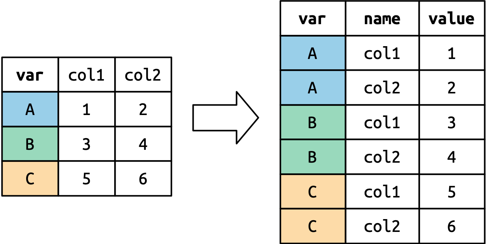

<!-- Add JavaScript code for making the exercise code larger -->
<script language="JavaScript" src="js/exercise-font-size.js"></script>
 

```{r setup, include=FALSE}
# file.path(find.package('gov50tutor'), 'tutorials', 'tutorial.css')
library(gradethis)
library(learnr)
library(ggplot2)
library(dplyr)
library(gov50tutor)
library(tidyverse)
library(gov50data)

tutorial_options(exercise.checker = gradethis::grade_learnr)
knitr::opts_chunk$set(echo = TRUE)
tut_reptitle <- "Gov 50 Tutorial 5: Output Report"

library(gapminder)
```

## Correlation and scaling

To illustrate the basics of correlation, we'll focus again on the `gapminder` data which has a few continuous variables

```{r}
gapminder
```

Let's use this data to explore correlation as a summary measure of the relationship between two variables. Correlations between variable can be calculated by using the syntax `cor(x, y)` where `x` and `y` are two vectors of the same length that we want to calculate the correlation of. We can do this in two ways for a data set. First, we can use the `$` operator to extract variables from our data like so:

```{r eval = FALSE}
cor(mydata$x, mydata$y)
```

Second, we can use the pipe and summarize combination:

```{r eval = FALSE}
mydata |>
  summarize(cor(x, y))
```

Let's try the first approach to find the correlation between `lifeExp` and `gdpPercap` in the gapminder data:


```{r cor1, exercise = TRUE}

```

```{r cor1-solution}
cor(gapminder$lifeExp, gapminder$gdpPercap)
```

```{r cor1-check}
grade_this_code()
```

Now let's try it the second way using pipe+summarize:


```{r cor2, exercise = TRUE}

```

```{r cor2-solution}
gapminder |>
  summarize(cor(lifeExp, gdpPercap))
```

```{r cor2-check}
grade_this_code()
```

### Z-scores

Correlations are calculated using z-scores of each variable. A z-score of a variable is a transformation that puts all variables on a common scale. This transformation subtracts off the mean of the variable from each unit and then divides by the standard deviation of the variable. We could do this transformation with:

```{r eval=FALSE}
mydata |>
  mutate(my_z = (x - mean(x)) / sd(x))
```

Let's now calculate the correlation "by hand" by creating z-scores for both `lifeExp` and `gdpPercap` and then taking the average of the product of these. 


```{r scale, exercise = TRUE}
gapminder |>
  mutate(
    lifeExp_z = ___,
    gdpPercap_z = ___
  ) |>
  summarize(cor = mean(___))
```

```{r scale-solution}
gapminder |>
  mutate(
    lifeExp_z = (lifeExp - mean(lifeExp)) / sd(lifeExp),
    gdpPercap_z = (gdpPercap - mean(gdpPercap)) / sd(gdpPercap)
  ) |>
  summarize(cor = mean(lifeExp_z * gdpPercap_z))
```

```{r scale-check}
grade_this_code()
```

## Tidying data

We sometimes get data in formats that are not ideal. The `mortality` data from the `gov50data` package is an example of this. It is a data with countries on the rows with measurement of child mortality by year in the columns:

```{r}
mortality
```

Compared to the `gapminder` data, this isn't ideal since we have information in the column names (year of the measurement) that we could better use if it were in the rows. So we would like to turn this into a data frame with rows that are country years. We can do this with the `pivot_longer` function. 

To see how this works, let's use an example from [R for Data Science](https://r4ds.hadley.nz/data-tidy.html#how-does-pivoting-work) with this simple tibble:

```{r}
df <- tibble(
  var = c("A", "B", "C"),
  col1 = c(1, 3, 5),
  col2 = c(2, 4, 6)
)
df
```

Now we can pivot this to put the columns into rows with this code:
```{r}
df |>
  pivot_longer(
    cols = col1:col2,
    names_to = "names",
    values_to = "values"
  )
```

This function duplicates any non-pivoting columns as many times as there are columns in `cols`. 

{width="50%"}

It then creates a new column with a name based on `names_to` that puts the names of each column in `cols`. 

{width="50%"}

Finally, it creates a new column with a name based on `values_to` that will contain each 

{width="50%"}


### Pivoting with mortality data

Let's try this with the `mortality` data. Complete the following code to pivot the columns `` `1972` `` through `` `2020` `` where the column names should go to a variable called `"year"` and the values in the columns should go to a variable called `"child_mortality"`. 


```{r pivot, exercise = TRUE}
mortality |>
  pivot_longer(
    cols = ____:____,
    names_to = ___,
    values_to = ____
  )
```

```{r pivot-solution}
mortality |>
  pivot_longer(
    cols = `1972`:`2020`,
    names_to = "year",
    values_to = "child_mortality"
  )
```

```{r pivot-check}
grade_this_code()
```


### Cleaning up the pivot

This pivot looks pretty good, but we have leftover junk that we can get rid of. Add the argument `values_drop_na = TRUE` to the call to `pivot_longer` and then remove the `indicator` variable using the `select()` function. The `values_drop_na = TRUE` argument will remove any missing values from the new values column. 


```{r pivot2, exercise = TRUE}
mortality |>
  pivot_longer(
    cols = `1972`:`2020`,
    names_to = "year",
    values_to = "child_mortality"
  )
```

```{r pivot2-solution}
mortality |>
  pivot_longer(
    cols = `1972`:`2020`,
    names_to = "year",
    values_to = "child_mortality",
    values_drop_na = TRUE
  ) |>
  select(-indicator)
```

```{r pivot2-check}
grade_this_code()
```

## Joining two data frames

In many situations we might have data for the same units in two different data frames. This is the case with the `gapminder` data and the `mortality` data that we've been working with. To combine the columns of the data frame, we can use the family of `join` commands. We these commands will find common identification variables in two data frames join the columns of both data sets aligned on these "joining variables." 

### left_join


There are two different ways that we can join that differ in how they handle rows that are present in one data set but not the other. The first is called `left_join()` and its syntax is:

```{r eval=FALSE}
df_1 |>
  left_join(df_2)
```

It will preserve all rows that are in the data set in `df_1` even if they are not present in `df_2`. The variables from the second data set will be missing for any rows that are in the first data but not in the second. 

Let's try to this with the gapminder and mortality data. We've set it up so that the mortality data has already been pivoted. Pipe the `mortality_tidy` to `left_join` and pass it the `gapminder` data to see what merge looks like. Note that the `gapminder` data is only measured every five years. 


```{r left-join, exercise = TRUE}
mortality_tidy <- mortality |>
  pivot_longer(
    cols = `1972`:`2020`,
    names_to = "year",
    values_to = "child_mortality",
    values_drop_na = TRUE
  ) |>
  select(-indicator) |>
  mutate(year = as.integer(year))

mortality_tidy |>
  _____(______)
```

```{r left-join-solution}
mortality_tidy <- mortality |>
  pivot_longer(
    cols = `1972`:`2020`,
    names_to = "year",
    values_to = "child_mortality",
    values_drop_na = TRUE
  ) |>
  select(-indicator) |>
  mutate(year = as.integer(year))

mortality_tidy |>
  left_join(gapminder)
```

```{r left-join-check}
grade_this_code()
```

### inner_join

The second way we might join is called `inner_join()` and it will only return rows that are present in both data sets. Let's try to merge the tidied mortality data with the gapminder data doing an `inner_join()`. What do you notice that's different about the rows that are returned?


```{r inner-join, exercise = TRUE}
mortality_tidy <- mortality |>
  pivot_longer(
    cols = `1972`:`2020`,
    names_to = "year",
    values_to = "child_mortality",
    values_drop_na = TRUE
  ) |>
  select(-indicator) |>
  mutate(year = as.integer(year))

mortality_tidy |>
  _____(______)
```

```{r inner-join-solution}
mortality_tidy <- mortality |>
  pivot_longer(
    cols = `1972`:`2020`,
    names_to = "year",
    values_to = "child_mortality",
    values_drop_na = TRUE
  ) |>
  select(-indicator) |>
  mutate(year = as.integer(year))

mortality_tidy |>
  inner_join(gapminder)
```

```{r inner-join-check}
grade_this_code()
```


## Submit

```{r context="setup", echo = FALSE}
gov50tutor::submission_ui
```

```{r context="server", echo = FALSE}
gov50tutor::submission_server()
```
